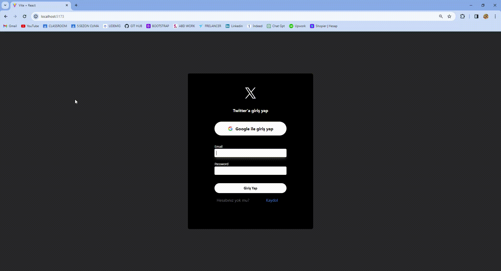

<h1>React FireBase TWitter Clone Proje</h1>

<h3>Kullanılan Kütüphaneler</h3>

<ul>
<li>Firebase</li>
<li>React-router-dom</li>
<li>React-icons</li>
<li>Moment</li>
<li>React-toastify</li>
<li>Tailwind</li>
</ul>

